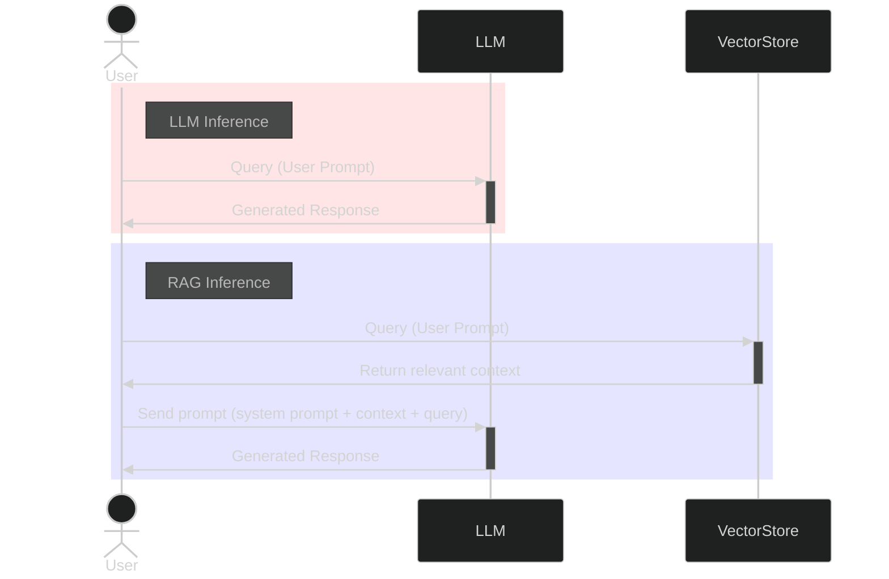

# Learning Large Language Model (LLM) Concepts

## Large Language Models (LLM)

Large Language Models (LLMs) are built on Deep Neural Networks that have been trained on vast amounts of data. The multiple processing layers in these models learn patterns and statistical insights from the training data. Using these patterns and insights, LLMs are able to generate intelligent responses to user inputs.

In plain language, the LLM begins by generating a summary of the input "*query*". The particular combination of "*keywords*" in the query points the LLM to a specific "*topic*", much like looking up the keyword in an "*index*" to find relevant pages and notes in a "*book*".

The LLM begins generating words close to or related to the given "*query*". Some words and language patterns are statistically more probable than others based on preceding content, and so these words are chosen by the LLM for the response. Since the LLM has learned language patterns, it is able to draft a coherent human-like "*response*".

Let's pull out the key words from the discussion above, and connect them to specific LLM terminology:

| Common Term           | Technical Term         | Description                                                                         |
| --------------------- | ---------------------- | ----------------------------------------------------------------------------------- |
| query                 | question / user prompt | The input from the user                                                             |
| prompt                | user prompt            | Complete input to LLM that kicks off the generation process                         |
| keywords              | tokens                 | Individual units of text processing -- characters, parts of words, words or phrases |
| topics                | embeddings             | Numerical representations of meaning                                                |
| book + topics + index | training data-set      | The corpus used to train the deep neural networks in the LLM                        |
| response              | response               | The model's generated output                                                        |

## Retrieval-Augmented Generation (RAG)

Now let us contrast the inference process when RAG is applied. Refer to the extended terminology table below.

When a RAG process is implemented, the user pre-empts the LLM and generates a set of "*notes*" from the input "*query*". This is done by identifying "*topics*" by looking up "*keywords*" in an "*index*" generated from a "*document store*", and extracting the content of all relevant topics, and concatenating into the notes. This is the **retrieve** part of a RAG.

The user then forwards an **augment**ed "*prompt*" to the LLM consisting of the "*notes*", "*query*", and "*instructions*". The LLM next uses the prompt to generate a "*response*" as usual. 

When implementing the RAG, we will observe that the quality of the response from the LLM is affected by the relevance of the notes provided. The question then becomes one of improving the relevance and quality of the content in the external document store.

The key difference between LLMs and RAGs then is the additional work of creating and consulting an external document store.

| Common Term           | Technical Term                            | Description                                                                                               |
| --------------------- | ----------------------------------------- | --------------------------------------------------------------------------------------------------------- |
| query                 | question / user prompt                    | The input from the user                                                                                   |
| **document store**    | **vector data store**                     | **Data-set with content relevant to expected queries, stored externally to the LLM**                      |
| **notes**             | **context**                               | **Relevant information for processing extracted from sources other than the training data-set**           |
| **instructions**      | **system prompt**                         | **Base behavior guidelines that instruct the LLM to take on a "role", apply a set of instructions, etc.** |
| prompt                | **system prompt + context +** user prompt | Complete input to LLM that kicks off the generation process                                               |
| keywords              | tokens                                    | Individual units of text processing -- characters, parts of words, words or phrases                       |
| topics                | embeddings                                | Numerical representations of meaning                                                                      |
| book + topics + index | training data-set                         | The corpus used to train the deep neural networks in the LLM                                              |
| response              | response                                  | The model's generated output                                                                              |

## Sequence Diagrams of LLM vs RAG Inference

